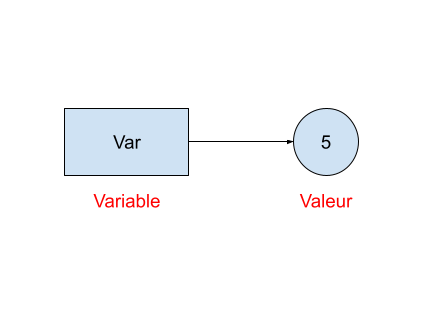

# Construction élémentaire

------

## 1. Affectation 

**<u>Variable :</u>** C'est l'association entre un nom et une valeur.



Ici la variable est _val_ et sa valeur est 5
- La valeur 5 est de **type** entier

**<u>Affectation :</u>** Une affectation est l'instruction qui va donner une valeur à une variable

```python
# Exemple de d'affectation sous Python :
>>> val = 5
# Appel de la variable val
>>> val
5
```

## 2. Types de bases sous python :

- ***int*** => Correspond aux nombre entier 
  - Exemple : 1 / 2 / 677777
  
- ***float*** => Correspond aux nombres décimaux (à virgule) 
  - **Sous python la partie décimale est séparée par un point "."**
  - Exemple : 0.1 / 1.66 

- ***str*** => Correspond aux chaines de caractères
  - Exemple : "Je suis une chaine de caractère" / 'Je suis une autre chaine'

## 3. Opérations élémentaires

Liste d'opérateurs disponible sous python :

- ***=*** Permet **d'affecter** une valeur à une variable 
```python
>>> variable = 6
>>> variable 
6
>>> variable = 7
>>> variable
7
```
- ***\+***  Permet **d'additionner** deux valeurs ou de les **concaténer** selon le type  
```python
    # Exemple avec le type 'int' :
    >>> 4 + 3
    7 
    # Exemple avec le type 'str' :
    >>> "Je suis un bout" + " de phrase"
    "Je suis un bout de phrase"
```
- ***-*** Permet de **soustraire** deux valeurs
```python
    # Exemple avec le type 'int' :
    >>> 4 - 3
    1
```
- ***\**** Permet de **multiplier** deux valeurs
```python
    # Exemple avec le type 'int' :
    >>> 4 * 3
    12
    # Autre exemple :
    >>> "test " * 3
    'test test test '
```
- ***/*** Permet de **diviser** deux valeurs 
```python
    # Exemple avec le type 'int' :
    >>> 12 / 3
    4
    # Exemple avec le type float :
    >>> 15 / 4
    3.75
```

**Rappel** : un nombre a et b par division euclidienne :
    - a = q * b + r (q est le quotient et r le reste)
        - 21 = 4 * 5 + 1

- ***//***  Permet de déterminer le **quotient de la division euclidienne** 
```python
    # Exemple avec le type 'int' :
    >>> 21 // 5
    4
    
```

- ***%*** Permet de déterminer le **reste de la division euclidienne**
```python
    # Exemple avec le type 'int' :
    >>> 21 % 5
    1
    
```

- ***\*\**** Permet de calculer un nombre n à la puissance p
  - Exemple : 2\*\*2 vaut 4 (2\*2) / 2\*\*3 vaut 8 (2\*2\*2) 
```python
    # Exemple avec le type 'int' :
    >>> 2**4
    16
```


