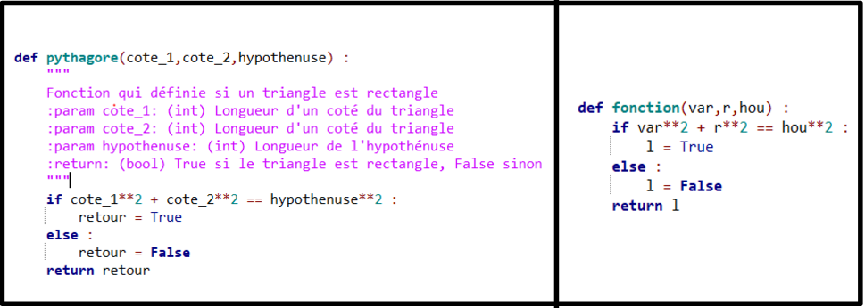

# TP spécification :

------

## 1. Prototyper une fonction : 

Avant d'écrire une fonction, il faut la **prototyper**, ce travail permet de savoir ce que l'on va programmer et dans quel but.

Afin de prototyper une fonction il faut : 
- Connaître le **but** de la fonction
- Connaître le ou les **paramètre(s) d'entrée**  
- La **valeur de sortie** 

Cette partie du travail de programmation va se retrouver dans la **documentation** de la fonction.

La documentation sera délimitée par un triplet de doubles guillemets **(""", """)**

> Il est possible de faire des commentaires non pris en compte par interpréteur python grâce aux 
> '#' (Voir exemple ci-dessous) 

```python 
#Exemple :
def ma_fonction(arg1,arg2) : 
"""
J'indique le but de la fonction
:param arg1: (type arg1) J'indique à quoi sert arg1
:param arg1: (type arg2) J'indique à quoi sert arg2
:return: (type) J'indique ce que sera le retour
"""
pass
```

## 2. Exemples d'application : 

Dans chacune des fonctions ci-dessous écrire la documentation

<u>Exemple 1 :</u> 

```python
def compte_le_nombre_de_caractere(chaine) : 
    """
    """
    # len permet de savoir le nombre de caractère d'une chaine
    # On calcule donc le nombre de caractère que l'on affecte à une variable
    nombre_de_caractere = len(chaine)
    # Puis on revoie la variable
    return nombre_de_caractere
```
<u>Exemple 2 :</u> 

```python
def incremente_valeur(valeur) :
    """
    """
    if valeur < 10 : 
        valeur = valeur + 1
    elif valeur > 10 : 
        valeur = valeur + 5
    else : 
        valeur = valeur + 10
    return valeur
```
<u>Exemple 3 :</u> 

```python
def complete_et_affiche_la_phrase(phrase) :
    """
    """
    phrase = phrase + "j'aime la nsi"
    print(phrase)
```

<u>Exemple 4 :</u> 

```python
def retourne_5():
    """
    """
    return 5
```

**Remarque :** Une fonction n'as pas forcément **de paramètre d'entrée** ou de **valeur de retour**

**Remarque bis :** Il est important lorsqu'on programme d'expliciter les noms de variable ou de fonction.

Une fonction qui affiche la température d'un four peut s'appeller **affiche_temp_four** ou encore une variable permettant de savoir le nombre de point d'un joueur peut s'appeller **nombre_point_joueur**.

Des variables s'appelant **var** ou **a** n'apportent aucune précision sur leurs utilités.

<u>Exemple :</u> 

