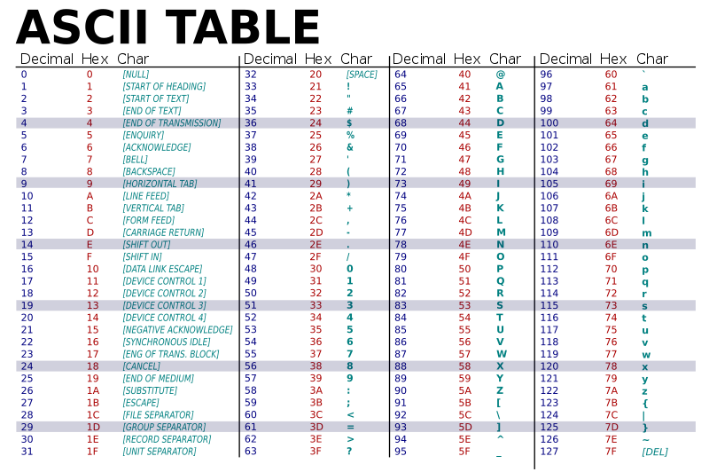

# Cours : Représentation des caractères

Tout comme les nombres, un ordinateur doit pouvoir représenter des caractères. Cela lui permet de stocker et échanger du texte. 

Afin d’avoir une bonne représentation il est évident de garantir plusieurs conditions : 

- Chaque caractère doit être représentable
- Chaque ordinateur doit avoir le même encodage pour communiquer
- L’encodage d’un caractère doit prendre le moins de place possible pour ne pas trop occuper l’espace mémoire.

Il faut prendre en compte aussi qu’il y a des caractères imprimables, ce sont ceux que l’on voit : 

- Tel que des lettres, des chiffres etc...

Il y a aussi les caractères non imprimables. Les retours à la ligne, les tabulations, le début et fin d’un fichier. 

# 1. Le codage ASCII :

Au départ il existait un grand nombre de représentations de caractères. Toutes distinctes elles ne permettaient pas de faire fonctionner ordinateurs avec imprimantes ou lecteurs de cartes *(voir cours sur architecture machine)*

C’est pour cela que dans les années 1960 un institut américain *(l’ANSI)* créa la norme ASCII *(American Standard Code for Information Interchange).* Ce codage défini 128 caractères (visibles ou non) sur 8bits (le bit de poids fort ne sert pas (le plus à gauche), le tout est sur un octet).



Cette table définie donc pour chaque caractère une représentation, nous pouvons la lire en décimal ou en héxa sur ce tableau. *(Dans les faits un ordinateur ne comprend que le binaire)*

### En python :

Il est possible de déterminer le numéro d’un caractère grâce à la fonction ord( ) et inversement de déterminer le caractère à partir d’un numéro.

**Par chance pour l’encodage ASCII, les résultats de ord( ) correspondent à leur représentation.**

```python
>>> ord('a')
97
>>> ord('A')
65
>>> ord(' ')
32
>>> chr(98)
'b'
>>> chr(64)
'@'
```

# 2. La norme ISO 8859 :

Nous le voyons avec l’exemple ci-dessus, le codage ASCII ne permet pas de coder des lettres avec accent. C’est le problème d’ASCII, il peut représenter trop peu de caractères. 

C’est pour cela qu’au fil des années d’autres représentations ont été créées. La norme ISO 8859 en est une. Celle-ci permet de coder les caractères non plus sur 7 bits mais 8. Offrant donc 256 caractères. 

Cependant les caractères 256 caractères ne suffisent pas à tout le monde. C’est pour cela que cette norme fut découpée en plusieurs parties. 

Par exemple : 

- ISO8859-1 nommée latin-1 permet de représenter la plupart des langues occidentales (français, allemand, anglais etc ...)
- ISO8859-2 nommée latin-2 prend en charge le polonais, le tchèque etc....

Par exemple :

```python
>>> ord('é')
233
>>> ord('ù')
249
```

De la même manière que pour le codage ASCII, **la représentation des caractères de la norme ISO 8859 est représentable par ord( ).**

Cette norme propose donc d’augmenter le nombre de caractères possible. Mais chaque caractère est écrit sur 2 octets au lieu d’un.

# 3. Unicode :

Unicode est un ensemble de caractères. Cet ensemble comprend tous les caractères (visible ou non) dans le monde et les numérote. 

Exemple :

- Les retours à la ligne
- Les lettres
- Les nombres
- Les lettres accentuées
- L’alphabet Chinois
- Les smileys
- Etc.

La fonction ord( ) de python donne juste le numéro de chaque caractère, la fonction **chr( )** est son contraire. A partir d’un numéro elle retrouve le caractère.

```python
>>> chr(152525)
'𥏍'
>>> chr(17555)
'䒓'
```

Ces caractères doivent avoir une représentation. Malheureusement ASCII et ISO8859 ne le permettent pas. 

# 4. Codage UTF-8 :

Ce codage est utilisé par +80% des sites web en décembre 2014 et 95,2% en 2020. *(source Wikipédia)* 

C’est le codage le plus optimal pour représenter tous les caractères d’Unicode.

| Numéro du caractère Unicode | Représentation en UTF-8 | Bits disponibles |
| --- | --- | --- |
| 0 à 127 | 0bbbbbbb | ....... |
| 128 à 2047 | 110bbbbb 10bbbbbb | ....... |
| 2048 à 65535 | 1110bbbb 10bbbbbb 10bbbbbb | ....... |
| 65536 à 1114111 | 11110100 1000bbbb 10bbbbbb 10bbbbbb | ....... |

Cet encodage reste très efficace pour des textes écrits avec des lettres latines. Car UTF-8 garde l’ordre unicode et donc écrira les lettres latines (tels que : e a c k é ù ...) avec seulement 1 voir 2 octets. 

Cependant pour les japonais par exemple leurs lettres sont numérotées en unicode de 12352 à 12543 *(comprend les deux alphabets)* et donc 1 caractère prend 3 octets de mémoire. 

C’est pour cela que UTF n’est pas totalement adopté partout. Car certaines langues sont moins optimisées que d’autres. 

Exemple : Le site web *Sony* japonais est codé en `shift_jis`  qui est un dérivé d’une norme ISO permettant de coder les caractères sur 8 bits en moyenne.