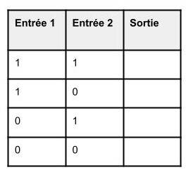

# Cours : Expressions booléennes

# Point historique :

C'est en 1847 que George Boole crée un mode de calcul faisant lien entre le raisonnement logique et les opérations algorithmique.

C'est ainsi que True et False (1 ou 0) sont apparus, permettant de représenter un ensemble de deux valeurs en lien avec la logique, ou l'électronique (Circuit ouvert ou fermé).

C'est fin des années 1930 (1936-1938) qu'est prouvé que l'algèbre de bool peut être représenté en circuit électrique. Cela constituera les bases de **l'informatique de Turing**.

# Rappel : Le type booléen et opérateurs de base :

Le type booléen se décline en deux valeurs **True** et **False** (1 et 0).

Celui-ci est le résultat d'une opération de comparaison tel que :

- <     inférieur à
- \> supérieur à
- <=  inférieur ou égal à
- \>=  supérieur ou égal à
- ==  égal à
- !=   différent de

# Opérateurs de l'algèbre booléenne :

Ces opérateurs permettent de créer des **expressions booléennes**, celles-ci utilisent seulement des **booléens**.

Chaque opérateurs peut être représentés par une **table de vérité.**

### Table de vérité :

Une table de vérité décrit tout les états possibles des valeurs d'entrées et donc décrira tout les sorties (résultats) possibles :



### Représentation graphique :

Chaque opérateur booléen est représenté par différentes représentations graphiques celles-ci permettent de créer des **circuits combinatoires** 

## Opérateur NON (NOT) :

L'opérateur NON prend **une valeur** et renvoie son inverse :

```python
# En python
>>> not(True)
False
>>> not(False)
True
```

En logique :

- !True ⇒ False
- !False ⇒ True

### Récapitulatif de l'opérateur NON :


## Opérateur ET (AND) :

L'opérateur ET prend aux minimums **deux valeurs** et renvoie Vrai si celles-ci valent toutes 1 :

```python
# En python
>>> True and True
True
>>> False and False 
False 
>>> True and False
False
```

En logique :

- True & True ⇒ True

### Récapitulatif de l'opérateur ET :

 


## Opérateur OU (OR) :

L'opérateur OR prend aux minimums **deux valeurs** et renvoie Vrai si au moins l'une d'entre elles est vraie :

```python
# En python
>>> True or True
True
>>> False or False 
False 
>>> True or False
True
```

En logique :

- True | True ⇒ True

### Récapitulatif de l'opérateur OR :


## *BONUS* Opérateur 'OU EXCLUSIF' (XOR) :

L'opérateur XOR prend aux minimums **deux valeurs** et renvoie Vrai si seulement une d'entre elles est vraie :

