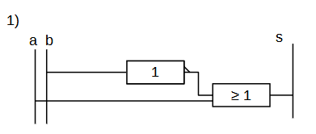
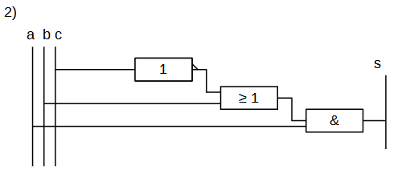
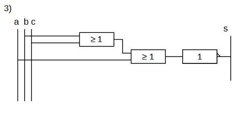

# Exercices : Expressions booléennes

# Application de cours :

### Exercice 1 :

Résoudre les expressions suivantes : 

1) !False

2) True & True

3) True & False

4) False | !(True)

5) 0 | 1

6) (1 & 0) | ( !(1 | 1) )

7) !( ( !True | False) & (True))

8) ((1|1) & (1|1)) & 0

### Exercice 2 :

Ecrire la table de vérité des expréssions suivantes : 

s1 = !a | b

s2 = (a & b) | c

s3 = (a | b) & !c

### Exercice 3 :

Pour chaque circuit :

- Ecrire l'expression booléenne correspondant :

- Ecrire la table de vérité de cette expression

- Quelle sera la sortie lorsque a = 0 , b = 1, c = 1

  

  

  

# Modélisation en python :

> **On appelle un prédicat une fonction renvoyant un booléen**

## Opérateurs booléens :

### Exercice 1 :

Ecrire les expressions booléennes de l'exercice 1 *(Application de cours)* en format python et en utilisant la syntaxe **True** et **False** *(pas de 0 et 1 ici).*

- True est l'équivalent de 1 en python
- False est l'équivalent de 0 en python

### Exercice 2 :

Ecrire un prédicat *xor (ou exclusif)* qui prend en paramètre deux booléens et qui répond à la table de vérité du cours. 

### Exercice 3 :

Ecrire une fonction triangle prenant en paramètre trois longueur et renvoyant le type de triangle qui lui est associé.

Rappel :

- Les conditions à respecter : 

  - Pour former un triangle il faut :

    - long1 + long2 >= long3 
    - long1 + long3 >= long2
    - long3 + long2 >= long1

    

    - <u>Pour qu'il soit équilatéral :</u>
      - les trois côtés doivent avoir la même longueur
    - <u>Pour qu'il soit isocèle :</u>
      - Deux côtés doivent être égaux
    - <u>Sinon il est "scalène" (quelconque)</u>

### Exercice 4 :

Une célèbre entreprise de tech a reçu un devis d'une bibliothèque, celle-ci demande à l'entreprise un robot permettant aux visiteurs de savoir dans quel couloir trouver les livres qu'ils recherchent. 

En effet, la bibliothèque possède trois étages, le rez de chaussé contient des livres jeunesses, le premier étage lui contient des livres de fantaisie et sciences-fictions enfin le dernier étage (2e) contient des livres sur la politique et l'économie. 

Le robot doit donc guider les visiteurs au bon étage sachant que :

- Un enfant ne peut accéder qu'au rez de chaussé
- Un ado peut aller au rez de chaussé et au premier étage
- Un adulte peut aller dans l'étage qu'il souhaite.

Ecrire une fonction prenant en paramètre le type de visiteur et le genre de livre qu'il recherche et renvoie l'étage associé s'il peut y accéder, sinon renvoyer un refus. (Il faut 4 lignes de conditions)

# Bonus : opération bit à bit avec les entiers

Testez et complétez ce code :

```python
>>> 5 & 2 
...
>>> 5 | 2
...
>>> 15 & 0
...
>>> 15 | 0
...
```

1) Que ce passe t'il ? Expliquez

2) Faites les calculs ci-dessous sur feuille. (Vérifiez le résultat avec python)

- 156 & 128
- 100 | 21
- 136 xor 45 (ou exclusif)
- 128 | 127

3) Ecrire les fonctions correspondant aux opérateurs '&', '|', 'xor'