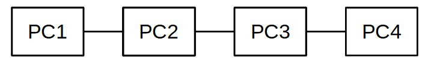
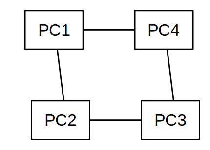
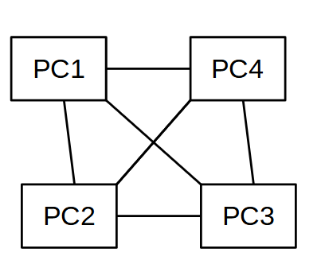
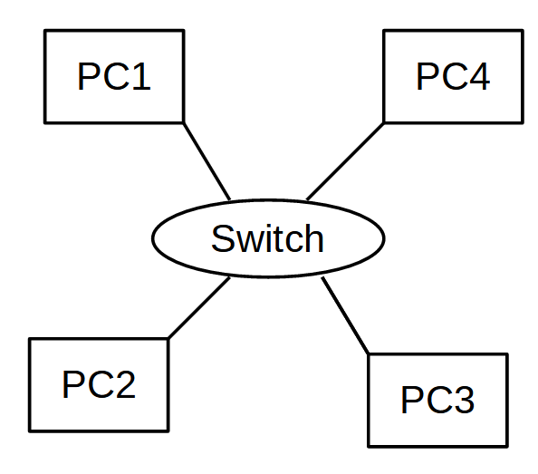
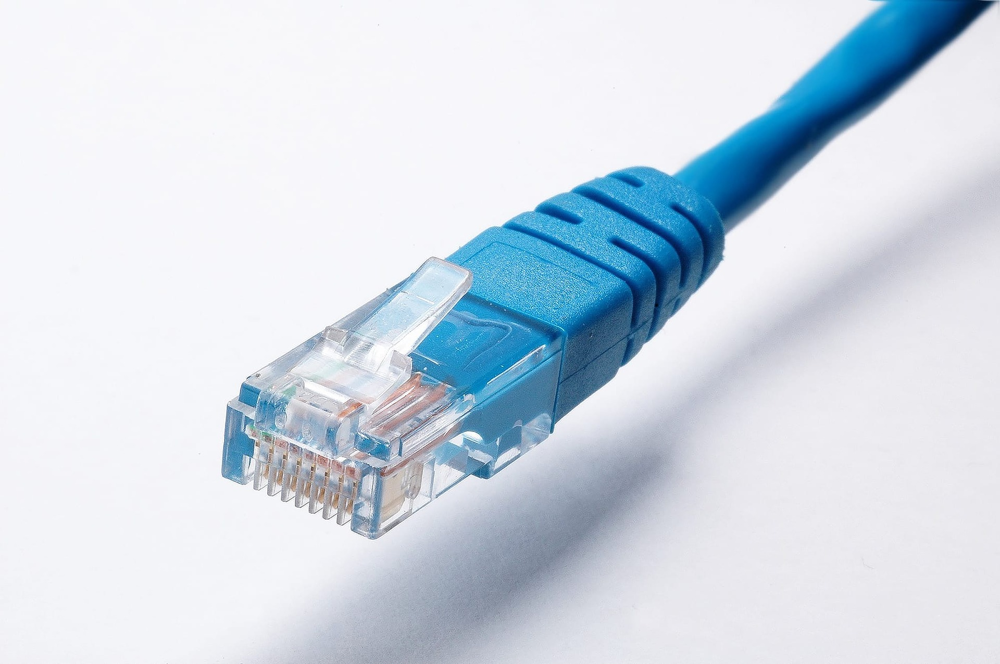
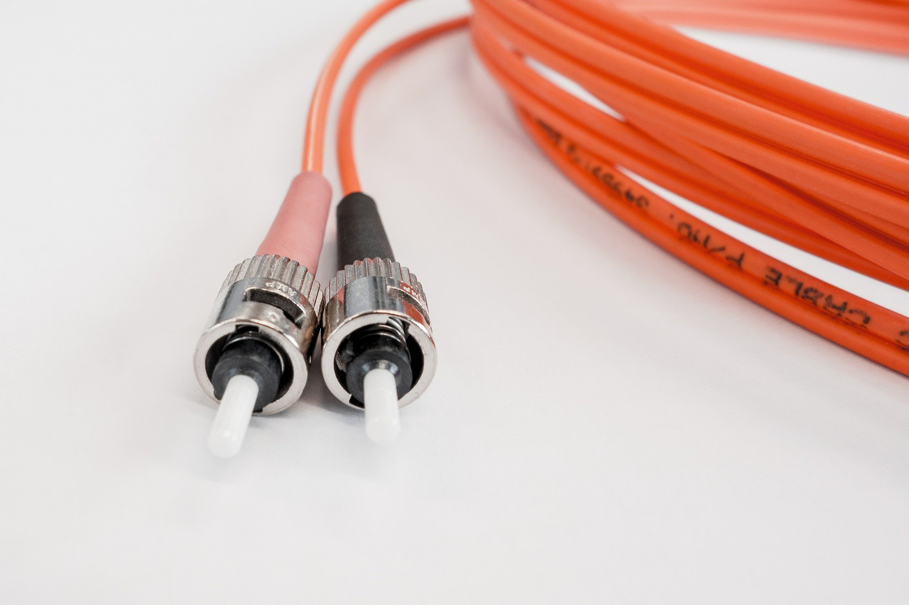
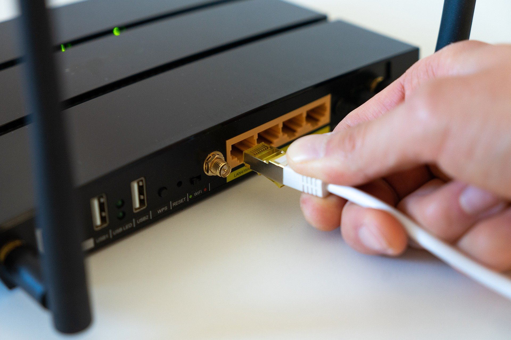

# Cours : Introduction au réseau

Un réseau est un ensemble de *noeuds et/ou composants* **reliés ensemble par des *liens.*** Celui-ci permet donc **une distribution de *flux*** (électricité, eau, gaz, etc..), **ou de *données discrètes*** (Informations, courriers, etc ..)

**En informatique** un réseau est composé d'équipements informatiques tel que des ordinateurs, des routeurs etc... Les liens en informatique sont divers eux aussi (sans fil, Ethernet, fibre optique). La distribution est basée elle sur l'échange de données, d'informations.

## 1. Quels sont les types de réseaux ?

### En informatique il existe différents types de réseaux :

<u>Les réseaux PAN :</u> 

Le réseau PAN (Personal Area Network) est un réseau restreint ayant une portée de quelques mètres. Il fonctionne grâce au protocole Bluetooth (ondes radio).

- Un téléphone relié à des écouteurs sans fil est un réseau PAN

<u>Les réseaux LAN :</u>

Le réseau LAN (Local Area Network) est un réseau à l'échelle d'une maison ou d'une entreprise. il est plus communément appelé réseau intranet.

- Des comptes élèves d'un lycée sont stockés dans le serveur du lycée, seules les machines connectées au réseau du lycée peuvent y accéder.

<u>Les réseaux MAN :</u>

Le réseau MAN (Metropolitan Area Network) est un réseau à l'échelle d'une ville. Il relie plusieurs réseaux LAN.

- Un campus universitaire est considéré comme un réseau MAN par exemple.

<u>Les réseaux WAN :</u>

Le réseau WAN (Wide Area Network) est un réseau à l'échelle d'un pays, utilisé par les grandes entreprises et les opérateurs. Le plus célèbre réseau WAN est **internet.** 

## 2. Topologie de réseaux :

### Il existe plusieurs manières de relier les équipements d'un réseau entre eux :

**La topologie en bus :**

Les machines du réseau sont reliées aux mêmes câbles : 

 Avantages :

- Peu coûteux
- Facile à mettre en œuvre

Inconvénients :

- Si le câble est coupé, le réseau est interrompu
- Faible sécurité, les données arrivent à toutes les machines
- Faibles performances / collisions de données

**La topologie en anneau :**

Les machines font circuler les données dans un même sens, évitant ainsi la gestion des collisions.

Une machine accepte les données reçues que si elles lui sont attribuées.

Avantages :

- Peu coûteux
- Evite la gestion des collisions

Inconvénients :

- La panne d'une machine bloque tout le réseau

**La topologie maillée :**

Toutes les machines sont reliées entre elles.

Avantages :

- Si une machine tombe en panne, le réseau fonctionne toujours
- On peut directement communiquer avec la machine correspondante

Inconvénients :

- Impossible avec un nombre important de machines
- Prix élevé

**La topologie en étoile :**

Cette topologie utilise un concentrateur (hub), un switch ou un routeur. Celui-ci reçoit les données et les renvoie aux autres machines du réseau.

Avantages :

- Ajout facile de machine
- Si une machine ne fonctionne plus le réseau fonctionne toujours

Inconvénients :

- Achat du matériel (switch, hub, routeur)
- Dépend du matériel central

## 3. Matériel informatique :

### 3. 1. La carte réseau :

Essentielle pour une communication réseau celle-ci contient l'adresse MAC de notre machine.

Il existe deux types de cartes réseau :

- Les cartes Ethernet : Via le port RJ45
- Les cartes WIFI : permettent le réseau sans fil

### 3. 2. Les liens informatiques :

Permettant de relier les cartes réseaux entre elles ces liens sont de diverses natures :

- Câble réseau Ethernet : Ce sont les câbles RJ45

- La fibre optique : Utilisant la lumière pour transmettre les données

- Les ondes : Telles que les ondes wifi ou radios

### 3. 3. Matériel réseau informatique :

**Hub (concentrateur) :**

Le hub permet de relier plusieurs machines entre elles par des ports Ethernet. A chaque transmission reçue il la renvoie à toutes les machines connectées. Ce matériel est remplacé aujourd'hui par le switch.

**Switch :**

Le switch est un hub intelligent, il sait à qui renvoyer la donnée grâce à une table ARP qui contient toutes les adresses MAC des machines qui lui sont connectées.

**Le routeur :**

Le routeur réseau est l'équipement permettant de relier différents réseaux entre eux. Il joue le rôle d'un switch et d'une interface réseau. 

