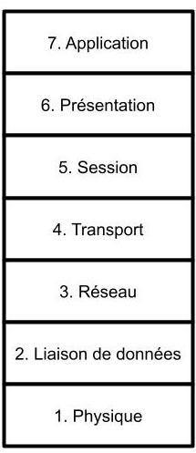
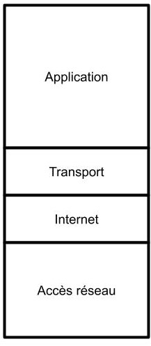
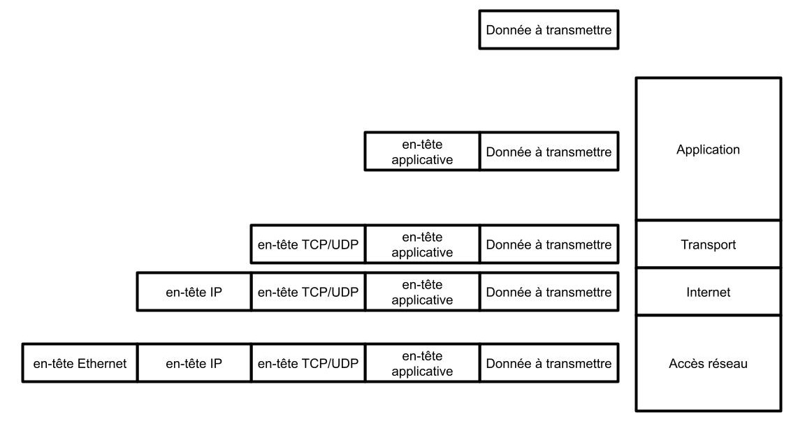

# Modèle TCP/IP :

------

## 1. Modèle en couches :

L'architecture d'un réseau est composée de couches, il est segmenté. Chaque partie du réseau joue un rôle pour l'envoie ou la réception d'une information.

Nous allons dans ce cours voir deux représentations de ce modèle :

<u>**Modèle OSI :**</u>



<u>**Modèle TCP/IP :**</u>




*Le modèle TCP/IP est une version "simplifiée" du modèle OSI.*

**Le modèle OSI** a été imaginé dans les années 1970, il permet de poser la base de la communication réseau.

**Le modèle TCP/IP** est un modèle plus récent supprimant des couches considérées comme inutile afin de simplifier le modèle.

La donnée à transmettre sera encapsulée par chacune des couches, celles-ci jouent un rôle précis et se contentent de faire leur travail à leur niveau.

#### Illustration de l'encapsulation :



Une fois la donnée reçue par l'autre ordinateur elle est décapsulée.

Chaque couche dans l'ordre suivant Accès réseau / Internet / Transport / Application décapsulera (traitera) les en-têtes unes à unes pour récupérer la donnée. (Pour plus de détail voir [Encapsulation_détaillée](./Explication_encapsulation.md))

## 2. Explication des différentes couches :

### 2. 1. Couche Accès réseau : 

Cette couche est responsable de la transmission effective des données sur le support physique du réseau (local)(via des câbles Ethernet , fibres optiques, ondes radio, etc.).

- Protocoles utilisés : Ethernet, Wi-Fi...
- Matériel utilisé : Cartes réseau, commutateurs (switches), routeurs

### 2. 2. Couche Internet :

La couche Internet est responsable du routage des paquets à travers différents réseaux pour atteindre la destination via les adresses IP.

- Adresse IP - une adresse logique attribuée à chaque périphérique sur un réseau.

### 2. 3. Couche Transport :

Couche qui gère l'ensemble des erreurs et des flux réseaux. Les deux principaux protocoles sont le protocole **UDP** et **TCP** :

- **Protocole UDP :**

  User Datagram Protocol, celui-ci est un protocole non connecté. Les données sont envoyées d'une machine A vers une machine B sans aucune vérification.

  Exemples : Streaming vidéo, jeu en ligne

- **Protocole TCP :**

  Transmission Control Protocol, celui-ci est un protocole connecté. Les données sont envoyées d'une machine A vers une machine B avec vérification de l'envoi. Un accusé de réception est renvoyé de la machine B vers la machine A.

  Exemples : Système de messagerie, mail (SMTP), partage de fichiers (FTP), requêtes HTTP(S).

### 2. 4. Couche Application :

C'est la couche la plus proche de l'utilisateur final et fournit des interfaces pour les applications réseau :

- FTP : Partage de fichier
- SMTP : Envoie de mail
- HTTP : Accéder à une page Web

Les applications, telles que les navigateurs web, les clients de messagerie électronique, etc., fonctionnent à cette couche. Elle gère  les détails spécifiques de l'application et facilite la communication  entre les programmes.

## 3. Les différents types d'adresses :

### 3. 1. Les adresses MAC :

Cette adresse est associée à une carte réseau, elle est non modifiable et unique. C'est l'adresse dite **physique**.

Il s'agit de 12 **nombres hexadécimaux** séparés par des "-" ou des ":" tout les deux symboles :

- Exemple : B5-EE-0A-A9-FF-20
  - Les 6 premiers nombre correspondent à une identification du constructeur, les 6 derniers correspondent à un numéro unique.
- Une marque aura donc pour toutes ses cartes réseau un début d'adresse MAC commune :
  - B5-EE-0A-00-00-00
  - B5-EE-0A-00-00-01
  - .....
  - B5-EE-0A-FF-FF-FF

Il est possible donc de créer 16**12 adresses MAC possibles. Et donc 16\*\*6 par constructeur.

Ces adresses sont manipulées dans la couche **ACCES RESEAU** du modèle TCP/IP. Deux ordinateurs non relié au réseau internet peuvent communiquer grâce aux adresses MAC.

### 3. 2. Les adresses IP :

Manipulée par un routeur, cette adresse permet d'identifier chaque appareil connecté au réseau. (Le réseau doit donc utiliser le protocole Internet (IP)(Couche Internet))

Il existe deux types d'adresse IP :

- Adresse IPV4 : Composée de 4 octets (32 bits) ces adresses sont les plus courantes à ce jour.
  - Le problème de ces adresses est dans leur nombre assez limité 2**32 sont possibles. Ce nombre va un jour être dépassé.
  - Exemple d'adresses IPV4 :
    - 192.168.0.1 (soit 11000000.10101000.00000000.00000001)
    - 255.255.255.255.0 (soit 11111111.11111111.11111111.00000000)
- Adresse IPV6 : Permettant de créer de nouvelles IP pour chaque appareil ces adresses s'écrivent sur 128 bits (contre 32 en IPV4) et offrent donc 2**128 possibilités d'adresses.
  - Exemples d'adresses IPV6 :
    - 2001:0db8:3c4d:0015:0000:0000:1a2f:1a2b

**Dans ce cours nous ne manipulerons que des adresses IPV4.**

#### Les adresses IP réservées :

- 127.0.0.1 : Adresse locale (Loopback)
- Masque réseau : Adresse permettant de créer des sous-réseaux. (Voir plus bas / TD)
- Adresse de diffusion (Broadcast) : Adresse permettant de communiquer avec tout les utilisateurs du réseau. (Voir plus bas / TD)
- Adresse privée :
  - 10.0.0.0 à 10.255.255.255
  - 172.16.0.0 à 172.31.255.255
  - 192.168.1.0 à 192.168.255.255

#### Les masques réseaux :

Toute adresse IP possède un masque réseau, celui-ci permet de différencier le réseau auquel la machine appartient et le numéro de la machine sur ce réseau.

Le masque réseau est représenté sous le format IPV4 (pour les adresses IPV4). Et permet donc de séparer la **partie réseau** et la **partie machine** d'une adresse.

Par exemple : 

- Une adresse IPV4 : 11000000.10101000.00000000.**00000001**
- Son masque :         11111111.11111111.11111111.00000000

La partie normale est la partie réseau la partie en **gras** est la partie machine

Une adresse IP est représentée comme : 

- 11000000.10101000.00000000.00000001**/24**
  - Le **/24** permet de dire qu'il y a un masque de 24 bits (Les 24 premiers bits sont à 1)
- Il peut aussi exister des masques avec plus ou moins de bits à 1 :
  - 11000000.10101000.00000000.00000001/13 (Le masque de cette adresse a les 13 premiers bits à 1)

#### L'adresse réseau :

Le masque permet de déterminer l'adresse réseau d'une machine, en effet grâce à l'opération ET bit à bit. Une adresse IP ET son masque permet de retrouver l'adresse réseau.

Le calcul est donc : 

    Adresse IP :     11000000.10101000.00000000.00000001
    Masque :       & 11111111.11111111.11111111.00000000
           		   = 11000000.10101000.00000000.00000000

#### L'adresse de diffusion :

L'adresse de diffusion permet de communiquer avec tout les utilisateurs du réseau.

Cette adresse se calcule grâce à l'opération **OU bit à bit** entre **l'adresse réseau** et le **masque inversé :** 

Dans notre exemple (ci-dessus) nous avons :

```
 Adresse IP :          11000000.10101000.00000000.00000001
 Masque :              11111111.11111111.11111111.00000000
 Masque inverse :  	   00000000.00000000.00000000.11111111
```

**L'opération Adresse IP OU Masque inverse donne donc :**

     Adresse IP :             11000000.10101000.00000000.00000001
     Masque inverse :      |  00000000.00000000.00000000.11111111                        
                           =  11000000.10101000.00000000.11111111

## 4. Différents services :

Internet est composé de différents services utilisant divers protocoles. 

#### Résolution de nom (DNS) :

Si l'on suit le raisonnement suivant chaque page WEB possède donc une adresse IP, lorsque je me connecte à mon site préféré je communique avec une adresse IP.

Cependant, pour accéder à une page WEB je n'utilise jamais d'adresse IP. Dans la barre de recherche, je tape le nom de mon site et j'y accède.

**C'est là que le protocole DNS intervient** celui-ci permet d'associer à une adresse IP un nom. Et de ce fait :

| IP             | NOM associé |
| -------------- | ----------- |
| 216.58.214.174 | google.com  |
| 104.244.42.193 | twitter.com |
| 75.2.56.173    | sncf.fr     |
| 195.64.164.87  | sncf.be     |

#### Page WEB :

Le fait de consulter une page WEB est l'un des services d'internet. Ce service fonctionne grâce au protocole **http(s).**

A **ne pas confondre Internet et Web**. Là ou internet à plus **une vision de réseau** (machines interconnectées dans le monde entier), le web **est une application permettant de visualiser des pages** (grâce aux navigateurs WEB).

D'autres applications sont par exemple l'envoie de mail (SMTP), le partage de fichier (FTP), etc... 

#### Attribution d'adresse IP :

Afin de connecter une machine à internet il est essentiel que celle-ci possède une adresse IP. Ce processus automatique est possible grâce au protocole **DHCP.** Ce protocole permet d'associer automatiquement une adresse IP à une machine. Il est aussi possible de le faire manuellement.