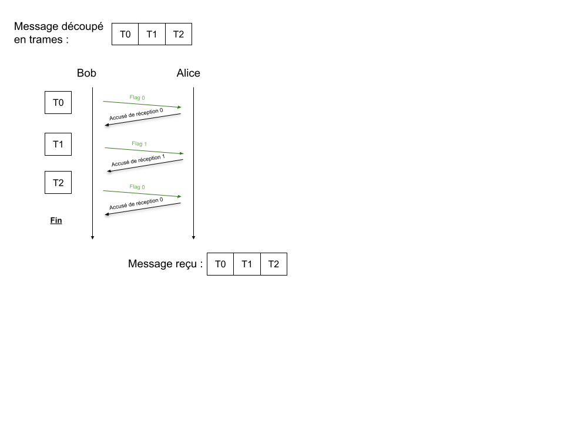
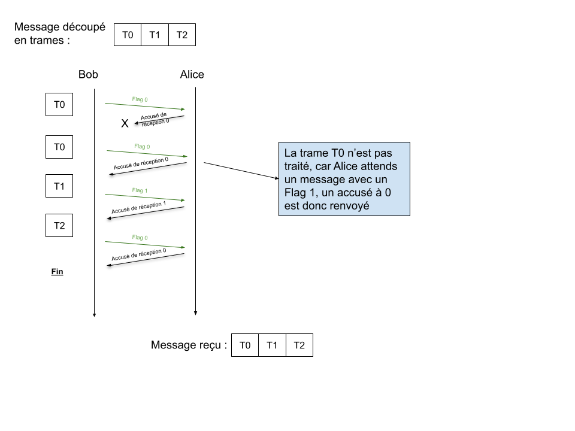

# Protocole du bit alterné :

------

<u>Rappel sur protocole TCP :</u> 

Le protocole TCP permet lui d'envoyer des données, de vérifier l'acquisition des données via un accusé de réception, et organise dans le bon ordre les données reçues. 

<u>Protocole du bit alterné :</u>

Le protocole du bit alterné à été utilisé pour la communication des ordinateurs dans les années 1970 jusqu'au années 90. 
Utilisé par le réseau ARPANET, ce réseau utilisait la commutation par paquets (que nous allons voir aujourd'hui). 

Ces paquets sont des parties d'une donnée que l'on souhaite envoyer d'un point A vers un point B. Afin d'envoyer ces données, plusieurs algorithmes existe. Le protocole du bit alterné est un des protocoles les plus simple. 

Le protocole du bit alterné se situe au niveau accès réseau du modèle TCP/IP et donc n'utilisent pas d'adresses IP. 
*On appelle les parties de données "trames" dans cette partie du réseau (pas des paquets)*

## 1. Fonctionnement du protocole :

Un message est découpé en différentes trames. Chaque trame sera envoyée dans un ordre précis (celui du message).

Les trames sont envoyée une à une entre deux ordinateurs, un émetteur et destinataire. 

Les trames (composées de bits) possèderont un bit flag. 

### 1. 1. Exemple de fonctionnement :

L'ordinateur émetteur envoie la trame avec un bit flag à 0, le destinataire lui renvoie un accusé de réception avec un bit flag à 1.

Une fois cet accusé de réception reçu, l'émetteur peut renvoyer un message avec un flag à 1. Puis le destinataire envoie un accusé de réception avec un flag à 0. Ainsi de suite ... 

<u>Illustration :</u>

### 1. 2. Exemple de fonctionnement avec erreurs :

<u>Trame ou accusé de réception non reçu :</u>

Dans le cas ou la trame envoyée ou l'accusé de réception n'est pas reçu, une nouvelle trame est envoyée avec le même flag par l'émetteur. Un chronomètre est activé après chaque envoi afin de pouvoir renvoyer le message si il n'est pas reçu.

<u>Trames reçues avec du retard :</u>

Une situation possible est qu'un message avec un flag (supposons 0), serait reçu bien plus tard que prévu. Et le message avec le même flag ne serait du coup pas reçu.  

*<u>A faire : A quoi pourrait ressembler les envois de messages avec des trames reçues en retard ? (deux cas possibles)</u>*
