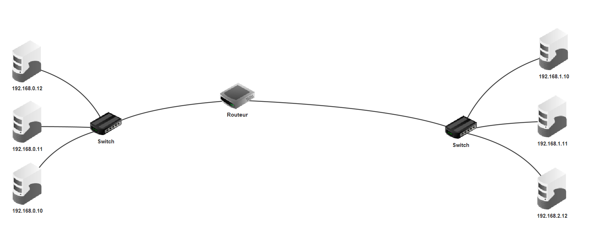

# TP : Modélisation d'un réseau informatique

------

## 1. Présentation :

Ce TP a pour but de construire et simuler quelques actions simples d'un réseau informatique. 

Le logiciel utilisé pour ce travail est Filius, une fiche outils est disponible dans le dossier FICHE_OUTILS

**Pour chaque exercice il est conseillé d'ouvrir un nouveau fichier.**

### Exercice 1 :

1. Créer un réseau de deux ordinateurs 
2. Faire un ping de la première vers la seconde machine.

### Exercice 2 : (Bonus)

1. Créer un réseau de trois machines. 
2. Faire en sorte que seuls deux machines puissent communiquer. (Une des machines ne doit pas appartenir au même réseau)
   - *Utiliser un switch pour créer un réseau de 3 machines*

### Exercice 3 :

1. Créer un réseau de 6 machines, toutes reliées à un switch. 
2. Passer en mode simulation.

**Pour la suite il faut impérativement passer la vitesse d'exécution à 1%.**

3. Simuler un ping d'une machine vers une autre. Que se passe t'il avant l'envoie du ping ?

4. Expliquer à l'aide d'une recherche internet le protocole ARP.
   - *(Si vous n'avez rien vu, passez en mode conception, puis repasser en simulation (cela réinitialisera la manipulation et le protocole ARP s'effectuera à nouveau))*

### Exercice 4 :

Réaliser les étapes ci-dessous :

1. Créer un réseau contenant 3 ordinateurs et un switch.

2. Attribuer les adresse IP suivantes :

   - 192.168.0.10

   - 192.168.0.11

   - 192.168.0.12

3. Créer un autre réseau (3 ordinateurs et un switch) avec les adresses suivantes :

   - 192.168.1.10

   - 192.168.1.11

   - 192.168.1.12

4. Relier les deux réseaux grâce à un routeur. *(Il faut choisir 3 interfaces ici)*
   - Voici une image de ce que l'on doit obtenir :

1. Essayer de faire un ping d'une machine du premier réseau vers le second et expliquez ce qu'il se passe.

2. Configurons notre routeur :

   - Le routeur possède 3 interfaces (ce qui correspondrait à 3 ports Ethernet en réalité)

   - Nous avons deux réseaux ici, donc deux interfaces occupées et deux adresses IP à renseigner.

   - Renseigner une adresse IP correcte pour chacune des interfaces (L'adresse doit appartenir au réseau correspondant)

   - Dans la section "Général" cocher la case "Routage automatique"

3. Essayer de faire un ping d'une machine du premier réseau vers le second et expliquez ce qu'il se passe.
   - Le problème ici est que votre ordinateur ne sais pas quelle adresse IP utiliser pour sortir de son réseau local.
       - Pour cela nous devons renseigner pour chaque machine la section adresse "Passerelle". Celle-ci doit contenir l'adresse IP du routeur (définie selon l'interface)

4. Essayer de faire un ping d'une machine du premier réseau vers le second et expliquez ce qu'il se passe.
5. Rajouter un autre réseau composé de 3 ordinateurs et d'un switch. Puis faire en sorte que les 3 réseaux puissent communiquer entre-eux

## Exercice 5 :

Pour cet exercice il est conseiller de réutiliser le réseau de l'exercice 4 (Si vous enregistrez les fichiers, faites en une copie)

1. Suivre les étapes suivantes :

   - Rajouter un ordinateur dans l'un des trois réseaux (Le nommer "Serveur Web")
       - Le rendre accessible depuis les 3 réseaux

   - En mode simulation, ajouter la fonctionnalité Serveur Web dans le nouvel ordinateur puis démarrer le serveur

   - Avec un autre ordinateur du réseau, télécharger navigateur web puis l'ouvrir

   - Rentrer l'adresse IP de votre serveur Web dans la barre de recherche. Que constatez vous ?

## Exercice 6 :

Pour cet exercice il est conseiller de réutiliser le réseau de l'exercice 5 (Si vous enregistrez les fichiers, faites en une copie)

Suivre les étapes suivantes :

- Rajouter un ordinateur dans l'un des trois réseaux (le nommer "Serveur DNS")
    - Le rendre accessible depuis les 3 réseaux
- Ajouter pour chacun des ordinateurs du réseau l'adresse IP du serveur DNS dans le champ "Serveur DNS"
- En mode simulation, ajouter la fonctionnalité Serveur DNS dans votre machine Serveur DNS.
    - Ouvrir le logiciel serveur DNS, puis ajouter le serveur WEB avec comme nom "NSI.com" et comme adresse IP l'adresse de votre Serveur WEB.
- Depuis une machine d'un des réseaux, connectez vous grâce au navigateur WEB sur le site NSI.com
    - Que constatez vous ?

Bonus : Créer un serveur WEB "vive_la_nsi.com" et rajoutez le dans le serveur DNS. Puis essayer de s'y connecter..