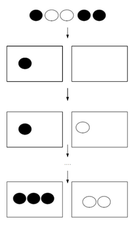
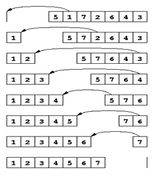

# Introduction aux tris :

------

## 1. Principe de base :

Couramment un tri consiste à répartir des objets selon leur nature ou une caractéristique qui est commune à ceux-ci

Par exemple : J’ai un sachet de billes, je peux alors les ranger par couleur ou par taille ...

Ce que l’on retient : 

- Il faut un critère de comparaison (ici la couleur des billes)

## 2. Principe en informatique :

En informatique le tri est quelque peu différent. En effet lorsque l’on va trier des éléments cela s’apparentera plus à les ranger dans un certain ordre.

Par exemple : J’ai plusieurs entiers. Je peux les trier par ordre croissant (ou décroissant)

*Voici une des manières de trier, il faut savoir qu’il en existe des plein d’autres*

## 3. Conditions pour trier :

Cela peut paraître évident, mais certaines conditions sont nécessaires pour effectuer un tri. 

- Premièrement, les éléments doivent être comparable. Il nous sera impossible à première vue de trier des entiers avec des chaines de caractère.
- Deuxièmement les éléments doivent être contenus dans une structure de données ordonnée et mutable. (Ex : tableau)