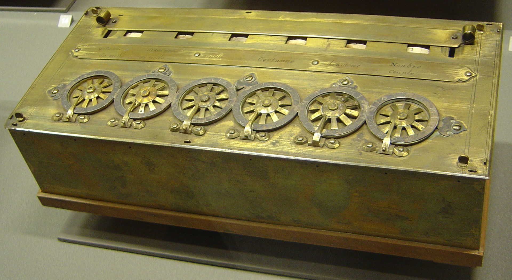
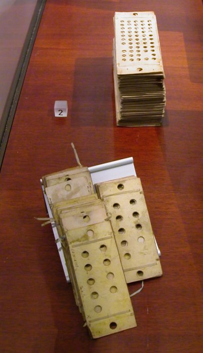
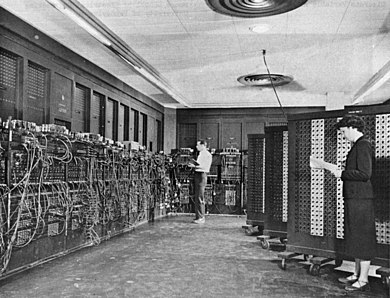
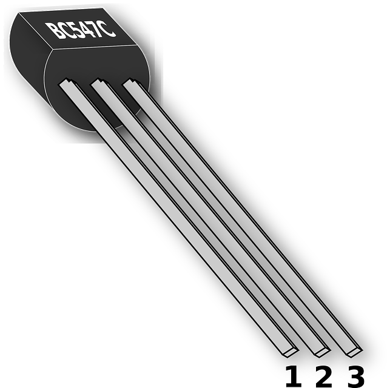
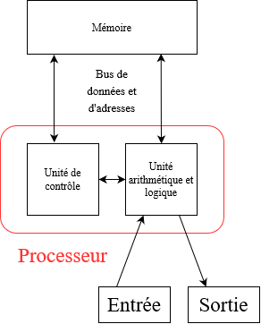

# Cours : Architecture d’une machine

------

## 1. Histoire des machines :

### 1. 1. Dans l'antiquité :

L’homme a toujours utilisé des machines pour réaliser des calculs plus ou moins complexes.

Dans l’Antiquité des “bouliers” étaient utilisés pour compter : 

*Photo d’un boulier chinois : [https://fr.wikipedia.org/wiki/Boulier](https://fr.wikipedia.org/wiki/Boulier)*

### 1. 2. Au 17ème siècle :

Une autre machine inventée par **Blaise Pascal** en **1652** (La Pascaline) permettant de faire les calculs suivants : 

- Additions
- Soustractions

*Photo d’une pascaline : [https://fr.wikipedia.org/wiki/Pascaline](https://fr.wikipedia.org/wiki/Pascaline)*

### 1. 3. Au 18ème/19ème siècle :

C’est au 18ème siècle qu’une machine importante fit son apparition il s’agit d’une **machine à tisser** qui fonctionnait avec des **cartes perforées**. Inventée par un lyonnais **Basile Bouchon.** 

Ces cartes seront utilisées par **Charles Babbage** qui à eu l’idée de les intégrer en **1908** dans une machine que l’on appellera **calculateur**.

*Photo de cartes perforées : [https://fr.wikipedia.org/wiki/Carte_perforée](https://fr.wikipedia.org/wiki/Carte_perfor%C3%A9e)*

Le premier algorithme exécutable fut écrit par **Ada Lovelace**.  

Au début des années **1980** un langage de programmation fut nommé en son honneur. Il s’appelle **Ada**

*Daguerréotype de Ada Lovelace : [https://fr.wikipedia.org/wiki/Ada_Lovelace](https://fr.wikipedia.org/wiki/Ada_Lovelace)*

### 1. 4. Au 20ème siècle :  

Voici un exemple de machine utilisant des cartes perforées : L’ENIAC crée en 1945

Cet ordinateur moderne de 30 tonnes et 167 m2 permet de faire 100 000 aditions par seconde. Il marche avec des cartes perforées et est entièrement électronique. 

*Photo de l’ENIAC : [https://fr.wikipedia.org/wiki/ENIAC](https://fr.wikipedia.org/wiki/ENIAC)*

Un ENIAC résoud un problème de trajectoire en seulement 3 seconde, alors que ce calcul à main (sans machine) prendrait environ 2 jours et demi. Un ordinateur de nos jours résoud ce problème en 0.00005 s (voir moins)

## 2. Architecture Von Neumann :

C’est en 1944 que l’ingénieur **John Von Neumann** proposa une nouvelle architecture qui aujourd’hui est toujours utilisée. Cette architecture utilise un espace mémoire permettant de stocker les programmes et les données. *(Donc plus de cartes perforées)*

### 2. 1. Le transistor :

Le transistor est un composant électronique utilisé dans la quasi totalité des circuits électronique. Il fut crée en 1947. 

*Réplique du premier transistor : [https://fr.wikipedia.org/wiki/Transistor](https://fr.wikipedia.org/wiki/Transistor)*

Un transistor fonctionne comme un interrupteur, sauf qu’il n’a aucune partie mécanique. L’ancêtre du transistor était un tube électronique. 

En 1965 le circuit le plus performant possédait 65 transistors.

*Image d’un transistor moderne : Pixabay, Image Libre*

### 2. 2. Microprocesseur et Loi de Moore :

La révolution de l’ordinateur eu lieu dans les années 1970 et plus précisément en 1971 avec la création du tout premier microprocesseur **Intel 4004.** Ce micro processeur possédait 2300 transistors et pouvait traiter des données de 4 bits. Une révolution pour l’époque.

Loi de Moore :

*Gordon E. Moore fut l’un des trois fondateur d’intel (célèbre entreprise d’informatique, encore aujourd’hui)*

La loi de Moore fut établie en 1965. Cette loi a permit d’établir la règle suivante :

- **A coût égal, le nombre de transistor d’un microprocesseur doublera tout les deux ans et ce jusqu’en 2015. (Règle finale en 1975)**

### 2. 3. Pourquoi 2015 ? : 

- Car la miniaturisation des transistors est limitée **par la taille des atomes**. En effet après 2015 les scientifiques visaient une taille de 2 nanomètres par transistor (soit 10 atomes) qui en 2018 n’était toujours pas atteinte.

A ce jours les des derniers processeur en date chez Intel possèdent une puce pouvant traiter des données de 64 bits avec des transistors ayant une taille de 10 nanomètres. Ces processeurs peuvent posséder 16 cœurs physiques (Donc peut effectué 16 opérations simultanées), contre 1 cœur pour l’Intel 4004.

## 3. Composition d’un ordinateur (Von Neumann) :

Voici l’organisation d’un ordinateur de Von Neumann qui est composé de :

- D’un espace mémoire
    - Sont stockés en mémoire les données et les programmes
- Le CPU (Central Processing Unit ou processeur)
- De périphérique d’entrée et sortie
- De bus : *Fils permettant de relier les différents composants par des impulsions électriques*

### 3. 1. Mémoire :

Il existe différents types de mémoires dans un ordinateur. Voici différentes caractéristiques pour les différentes mémoires : 

- Coût (financier)
- Vitesse
- Durabilité
    - Volatile
    - Permanente
- Capacité

### 3. 2. Registre :

Il s'agit d'un emplacement mémoire interne au processeur qui permet de stocker des opérandes et des résultats intermédiaires lors des opérations effectuées dans l'UAL (Unité Arithmétique & Logique) et d'accéder très rapidement à son contenu.

### 3. 3. Mémoire cache :

Aussi appelée mémoire tampon, elle est très rapide et permet de réduire le temps d'attente pour l'accès à la ***mémoire vive***.

### 3. 4. Mémoire vive :

Il s’agit d’une mémoire dynamique avec de très grandes fréquences. Mais celle-ci est effacée lorsque l’ordinateur est éteint.

### 3. 5. Mémoire flash (DD et SSD) :

Différenciée par deux périphériques la mémoire flash ou mémoire. 

## 4. Processeur :

### 4. 1. Unité Arithmétique et Logique :

Composée de plusieurs registres, cette unité effectue les opérations arithmétiques (additions, soustractions, etc ...) et des opérations logiques (comparaison, et, ou, etc...), des opérations sur les bits (rotations) et des déplacements mémoires.  

### 4. 2. Unité de contrôle :

Permets de contrôler le système et est chargé du séquençage des opérations

Elle récupère les instructions et les décode.

## 5. Langage machine :

Le langage machine est une suite de bits interprétée par le processeur. Il ne s’agit pas d’un programme lisible par un humain. Certains de nos langages de programmation dit de **haut niveau** sont compilés en langage machine (Comme le **C** ou **C++**). Lorsque l'on compile un code, on le transforme en une suite de 0 et 1 en langage machine donc, via un **exécutable**. Puis cet exécutable est traité directement par le processeur.

Python lui est un langage **Interprété**, le code est traduit via un **Interpréteur** (une sorte de programme permettant de traduire le code écrit). Ici il n'y a pas d'exécutable créer, le code lui est directement utilisé. 

Pour programmer en directement au niveau du processeur de la machine, il existe le **langage assembleur** permettant de faire quelques instructions simples (déplacer des données, multiplier, additionner, etc ...).

**Il est important de comprendre qu'un langage de bas niveau est plus facilement utilisable par un processeur, la où un langage de haut niveau demandera des transformation (en nombres binaires) pour être utilisé par le processeur.**

