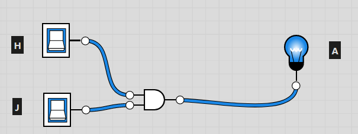

# TP : Circuits combinatoires

------

## 1. Introduction :

Nous l’avons vu dans le cours un transistor est un composant permettant ou non de laisser passer du courant. C’est de là que vient le binaire, la valeur 1 est obtenue lorsque le courant passe et inversement pour la valeur 0. 

Le transistor est à la base de tous les circuits logiques et donc de l’algèbre de Bool *(voir cours sur les booléens).* Le but de se TP est donc de comprendre comment peuvent être schématisés certains circuits combinatoires présents dans l’architecture de notre ordinateur.

## 2. Création des circuits :

Afin de créer les circuits nous allons utiliser le site : [Logic.ly](http://Logic.ly) => Try online

Voici un exemple de circuit : 

Il s’agit ici, d’un circuit équivalant à l’expression booléenne : **H and J** 

Ici les interrupteurs valent 1 et donc 1 and 1 ⇒ 1 (Et l’ampoule s’allume)

**Le but du TP est de reprendre des expressions booléennes et d’en créer des circuits** 

Pour réaliser les circuits nous avons besoin des outils suivants : 
- Toggle Switch
- Light Bulb
- NOT Gate
- AND Gate
- OR Gate
- XOR Gate
- 4-Bit Digit / Light Bulb

## 3. A faire :

Pour chaque expression ci-dessous construire le circuit, prendre une capture d’écran et la stocker dans un fichier .odt (word)

- A OU B
- NON (A OU B)
- (A ET NON B) OU C
- A XOR B (sans utiliser la porte XOR)
- La première loi de De Morgan : NON (A ET B) ⇒ NON A OU NON B (Afficher les deux expressions sur le circuit)
- La deuxième loi de De Morgan : NON (A OU B) ⇒ NON A ET NON B (Afficher les deux expressions sur le circuit)

- Le demi-additionneur : *(Retrouver l’expression booléenne dans le tableau ci-dessous)*

| A | B | Sortie Retenue | Sortie somme |
| --- | --- | --- | --- |
| 0 | 0 | 0 | 0 |
| 0 | 1 | 0 | 1 |
| 1 | 0 | 0 | 1 |
| 1 | 1 | 1 | 0 |
- L’additionneur : *(Retrouver l’expression booléenne dans le tableau ci-dessous)*

| A | B | Retenue | Sortie retenue | Sortie Somme |
| --- | --- | --- | --- | --- |
| 0 | 0 | 0 | 0 | 0 |
| 0 | 0 | 1 | 1 | 0 |
| 0 | 1 | 0 | 1 | 0 |
| 0 | 1 | 1 | 0 | 1 |
| 1 | 0 | 0 | 1 | 0 |
| 1 | 0 | 1 | 0 | 1 |
| 1 | 1 | 0 | 0 | 1 |
| 1 | 1 | 1 | 1 | 1 |