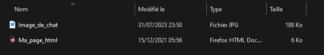
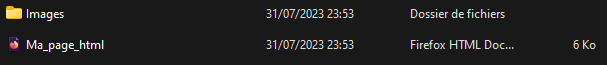

# Balises HTML :

Voici une liste non exhaustive de balises HTML : 

### Formatage de la page :

| Nom de la balise | Utilisation                                                  | Exemple                                                  |
| ---------------- | ------------------------------------------------------------ | -------------------------------------------------------- |
| p                | Permet d'écrire une phrase                                   | \
 Je suis une phrase \
                            |
| h1               | Permet d'écrire un titre de taille 1 (Possible de faire des titres de taille 2,3 .. 6) | \<h1> Je suis un titre \</h1>                            |
| li               | Elément d'une liste                                          | \<li> Premier element \</li>                             |
| ul               | Liste non ordonnée, permet de commencer une liste d'éléments **li** qui seront non ordonnés | \<ul>\<li> Element 1</ li> \<li> Element 2 \</li> \</ul> |
| ol               | Liste ordonnée, même principe que ul                         | \<ol>\<li> Element 1</ li> \<li> Element 2 \</li> \</ol> |

### Formatage du texte :

| Nom de la balise | Utilisation                                                  | Exemple                             |
| ---------------- | ------------------------------------------------------------ | ----------------------------------- |
| i                | Permet d'écrire en italique                                  | \<i> *Je suis en italique* \<\i>    |
| b                | Permet d'écrire en **gras**                                  | \<b> **Je suis en gras** \</b>      |
| a                | Permet de créer un lien, la destination du lien est à écrire dans le paramètre href comme ci contre. | \<a href ="www.lien.fr"> Lien \</a> |

### Insertion d'une image :

Pour insérer une image nous utilisons une balise **img** celle-ci se présente sous cette forme :

- \

Ici nous souhaitons insérer une image de chat appelée *Image_de_chat.jpg*, il faut cependant que l'image soit dans le même dossier que la page HTML.

Il est possible de stocker l'image dans un dossier, la balise sera de la forme suivante :

- \

Ici l'image est dans mon dossier **Images** alors je le précise dans la balise.

**Il faut faire bien attention à renseigner extension de l'image dans la balise, vous retrouverez des images .jpg .png etc ...**