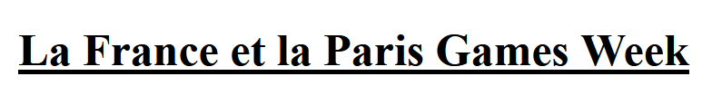

# Cours : Le langage CSS

------

# 1. Introduction :

Apparu dans les années 1990 le langage CSS agit sur la forme de la page. Il permet de rajouter des fonds d’écrans, de changer la police d’un texte. Il agit toujours sur un fichier HTML.

Il est possible aussi de placer les éléments comme on veut et de créer quelques **interactions**

Voici un exemple dans lequel nous retrouvons une page en HTML qui change totalement selon la page CSS associée.

Lien : [http://www.csszengarden.com/tr/fr/216/](http://www.csszengarden.com/tr/fr/216/)

Le code CSS est écrit dans un fichier à part de l’html. Mais celui-ci est relié à la page dans la partie **head** grâce à la balise <style> 

Exemple :

```html
<link rel="stylesheet" type="text/css" href="../css/commune.css">
```

Une fois le lien crée, il faut simplement agir sur le fichier CSS afin d’embellir la page HTML.

# 2. Utilisation du code CSS :

Le code CSS peut agir sur différents éléments :

- Il est possible de sélectionner toutes les balises d’un fichier

Exemple :

```css
body{
  margin-left: 150px;
  background-image: url(../images/Mario.jpg);
  background-attachment: fixed;
  background-position-y: -1300px;
}
```

- Il est possible d’associer un id à une balise et d’agir sur la balise possédant cet id
    - L’ID doit être unique dans une page. Lorsqu’un nom d’ID est choisi il ne faut plus le réutiliser.

```html
#Dans un fichier html
<p id='Test'>Je suis un paragraphe avec un id nommé Test </p>
```

```css
#Test{
font-size: 25px;
}
```

**Un point important est de comprendre qu’il y a un ordre de priorité en CSS. Les attributs donnés en fin de fichier sont prioritaires par rapport à ceux donner en début de fichier.**

Exemple :

```css
p{
color : blue;
}
p{color : red;}
```

Ici nous avons deux styles pour la balise p (A ne pas refaire), dans ce cas le texte de la balise p sera en rouge car le code prendra en compte le dernier style écrit.

# 3. Interactions en CSS :

Le langage CSS est fait pour ajouter de la forme à votre page HTML. Il n’y a que très peu d’interaction à créer.

Il est possible par exemple lorsque l’on survole un élément avec le curseur de la souris de faire une action. 

Par exemple :

```css
h1:hover{
transform : translate(15px) scale(1.4) skewX(5deg);
}
```

Lorsque l’on passe le curseur sur un titre h1 une transformation du texte est appliquée :

- Le texte est décalé de 15 px (à droite (-15px pour aller à gauche))
- Il est 1,4 fois plus grand
- Créer une distorsion horizontale

Exemple : 



Ce qui donne : *(C’est une image coupée sur la gauche normalement cela n’apparait pas)*


# Exemple de propriétés CSS :

La liste complète de propriétés CSS est disponible sur le MDN (Mozilla Developer Network) dans le lien ci-dessous : 

- [https://developer.mozilla.org/fr/docs/Web/CSS/Using_CSS_custom_properties](https://developer.mozilla.org/fr/docs/Web/CSS/Using_CSS_custom_properties)

Voici cependant quelques propriétés principales :

| Propriété | Description |
| --- | --- |
| font-family | Police d’écriture |
| font-size | Taille du texte |
| text-decoration | Soulignement |
| text-indent  | Alinéa |
| color | Couleur du texte |
| background-color | Couleur de fond |
| background-image | Image de fond |
| background-attachment | Fond fixe ou non |
| width | Largeur |
| height | Hauteur |
| margin-(top/left/right/bottom) | Marge (Soit du haut, ..., bas) |
| padding-(top/left/right/bottom) | Marge interieure |
| border-width | Epaisseur de bordure |
| border-color | Couleur de la bordure |
| display | positionnement de la balise (utile pour les images) |
| position | Positionnement (utilisé pour les images) |

> Lorsque l’on code une page WEB il est évident que l’on ne connaît pas toutes les propriétés CSS et les balises HTML. Un bon développeur sait ou se renseigner pour trouver les bonnes informations. 

N'apprenez pas toutes les balises et propriétés, la connaissance vient avec la pratique.

Mais apprenez à vous renseigner, à savoir ou chercher les bonnes informations.