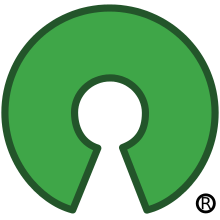

# Cours : Les logiciels libre

------

## 1. Qu’est ce qu’un logiciel libre ?

Un logiciel libre est un logiciel qui garantit 4 libertés fondamentales :

- La liberté d’utiliser le logiciel
- La liberté d’étudier le logiciel
- La liberté de copier le logiciel
- La liberté de modifier le logiciel et de redistribuer les versions modifiées

Il est opposé aux logiciels ***propriétaires*** qui privent l’utilisation de liberté.

**Logo du projet GNU initiateur du mouvement du logiciel libre :**

### Liberté 0 : Utiliser le logiciel

Cette liberté permet à n’importe qui (utilisateur, entreprise) de faire fonctionner le programme pour n’importe quelle tâche.

A ne pas confondre avec un logiciel défaillant, par exemple si un logiciel plante avec certaines données il n’est pas forcément ‘propriétaire’, le problème peut être corrigé.

Un contre-exemple de cette liberté peut être les logiciels “gratuits” ou “les version d’essai” qui restreignent les libertés d’utilisations.

### Liberté 1 : Etudier le code source et le modifier

Cette liberté est fondamentale car elle permet à l’utilisateur de modifier le logiciel afin de l’adapter à son utilisation. Pour cela un logiciel doit forcément être **open source.**

**Logo de l’Open Source Initiative :**

Un logiciel open source lui permet d’être le plus performant possible, en effet tout le monde peut travailler dessus, afin de trouver des améliorations possibles, des failles etc .. Ce qui rend le travail collaboratif.

### Liberté 2 : Copier le logiciel

Cette liberté permet de pouvoir simplement partager un logiciel avec n’importe qui. Une copie du fichier sous forme binaire par clé USB ou envoie sur internet est à la portée de tous.

Ceci ne limite pas le nombre de copies, et de personnes à qui nous donnons le logiciel.

Un logiciel propriétaire vous interdit de le partager. Si le partage est fait alors le contrat (CLUF) est rompu.

### Liberté 3 : Copier le logiciel modifié

Si la liberté 1 et 2 permettent de modifier et de copier un logiciel il est logique de pouvoir distribuer la version modifiée. Que ce soit pour un usage privé ou professionnel, la modification et la publication de celle-ci peut se faire librement sans prévenir personne.

Exemple Ubuntu : Kunbuntu, Xubuntu, Moebuntu, Linux Mint …

### Copyleft :

Le copyleft est une licence permettant la garantie pour un logiciel de rester libre. Celle-ci permet lors de la modification d’un logiciel de conserver les 4 libertés. La licence du logiciel est et restera Copyleft s’il est partagé.

**Logo du copyleft :** 

## 2. Quelques exemples de cas concrets :

### Amazon et tablettes Kindle :

Un manque de contrôle de logiciel propriétaire est avec les tablettes Kindle d’Amazon. Celles-ci permettent de lire des copies de livres numériques vendues exclusivement par Amazon. Sauf qu’une copie de livre non vendue par Amazon sera supprimée de la Kindle ce qui peut montrer le manque de contrôle de l’utilisateur.

### Perseverence sur Mars :

Lorsque le rover Persévérance a atterri sur Mars (2021) il embarquait un logiciel et un système d’exploitation libre. Ce rover est rempli de technologie, il peut se déplacer, filmer, faire de nombreux calculs, récupérer des échantillons etc ..

Perseverence fonctionne sous Linux, et son logiciel développé par la nasa est disponible sous GitHub en open source.

Ce grand projet a pu être élaboré grâce aux logiciels libres car en effet de nombreuses personnes ont pu faire des tests sur le logiciel de la nasa.

## 3. Exemples de logiciels :

Non libre / Gratuit : - Internet explorer, Acrobat Reader ..

Non libre / Non gratuit : - Windows ..

Libre / Non gratuit : - Red Hat, Xenix (OS microsoft sous linux) …

Libre / Gratuit : - Distributions commerciales de Linux; Thonny, Firefox …

## 4. Bibliographie :

« 4 libertés – Liberté GNU/Linux ». Consulté le 2 mars 2021. https://vive-gnulinux.fr.cr/logiciel-libre/4-libertes/.

« Qu’est-ce que le logiciel libre ? - Projet GNU - Free Software Foundation ». Consulté le 2 mars 2021. https://www.gnu.org/philosophy/free-sw.fr.html.

Jean, Aurélie. « Aurélie Jean – Merci « Perseverance » ! Le logiciel libre arrive sur Mars ». Le Point, 28 février 2021. https://www.lepoint.fr/invites-du-point/aurelie-jean-merci-perseverance-le-logiciel-libre-arrive-sur-mars-28-02-2021-2415748_420.php.

appvizer.fr. « Licence open source : définition, copyleft et logiciel libre | Appvizer ». Consulté le 10 mars 2021. /magazine/services-informatiques/gestion-licences/licence-open-source.