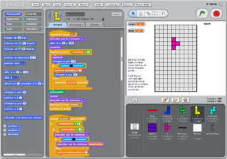

# Qu'est ce que la programmation, qu'est ce que python ?

------

## 1. La programmation

La programmation informatique consiste à créer des **instructions** ou des séquences d'opérations pour un ordinateur afin qu'il exécute des tâches spécifiques. En d'autres termes, c'est la manière dont les **développeurs/développeuses** communiquent avec les **machines** pour leur faire accomplir des actions ou résoudre des problèmes.

La programmation implique la création de **programmes** en utilisant des **langages de programmation**, qui sont des systèmes de notation formelle permettant aux développeurs de décrire précisément les étapes nécessaires pour accomplir une tâche. Ces langages de programmation peuvent être basés sur du **texte** ou utiliser des **interfaces graphiques**.

*Le langage **scratch** appris au collège se base sur une interface graphique*

*(Source : Wikipédia)*

En tant que développeur/développeuse nous avons différentes étapes lorsque nous travaillons :

- Nous avons dans un premier temps la **conception** du programme.
  - La conception du programme est l'étape la plus importante, c'est là que tout se joue. Il faut penser aux **objectifs** du programmes selon les **ressources** que nous avons à disposition afin de créer un code propre et fonctionnel.
- Dans un second temps, **l'écriture** du programme :
  - Une fois les idées en place, on commence à écrire notre code pour valider (ou non) les objectifs émis lors de la conception.
- Dernière étape, la phase de **test** :
  - En effet après avoir écrit notre code il faut l'essayer, celui va peut-être fonctionner. Si c'est le cas, que les objectifs sont validés alors c'est réussi. Sinon c'est qu'il y a soit un problème **d'écriture** du code, voir de **conception**. 

La programmation informatique est utilisée dans une variété de domaines, tels que le développement de logiciels *(Word, Système d'exploitation, Netflix, Navigateur Web)*, la création de sites web *(Facebook, SNCF, Wikipédia)*, la conception de jeux vidéo *(Minecraft, Leagues of legend, Snake, etc...)*, la modélisation et la simulation *(SolidWorks, Blender)*, l'automatisation industrielle, l'intelligence *(ChatGPT)*, l'apprentissage automatique, et bien d'autres.

Les programmeurs/programmeuses de logiciels sont chargés de **créer**, **maintenir** et **améliorer** les programmes informatiques, ce qui nécessite des compétences en résolution de problèmes, en logique, en conception d'algorithmes et en compréhension des langages de programmation et des technologies associées.

## 2. Python

Comme expliqué ci-dessus, afin de créer des programmes nous avons besoins de langages de programmation, ces langages sont des solutions permettant de créer certains type de programmes. Selon nos besoins certains programmes sont plus adaptés que d'autres, car chacun a ses propres caractéristiques. On peut par exemple parler de langages compilés/interprété *(Fiche explicatives disponible)*.

Le langage principalement utilisé au lycée est le langage **Python**, il a la particularité d'être assez basique dans son écriture, il est polyvalent et peut être utilisé assez facilement sur de nombreuses machine.

Pour coder, il est intéressant d'utiliser un logiciel adapté à la programmation. Ces logiciels sont appelés des **IDE** (Environnement de Développement Intégré), en python il en existe une multitude, mais nous utiliserons en classe le logiciel **Thonny** *(ou Edupython)*.