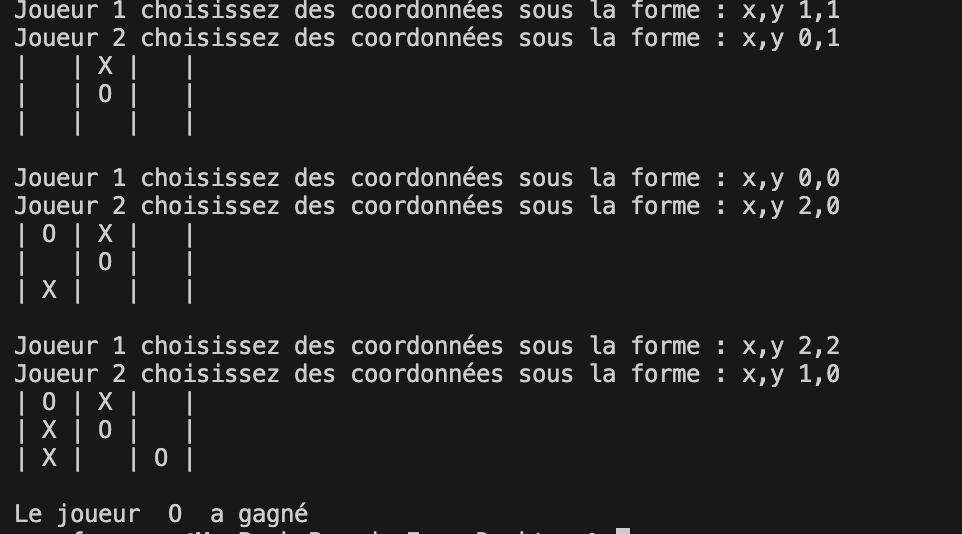

# Projet Morpion :

Le but du projet est de reproduire le jeu du morpion pour 2 joueurs. Les deux joueurs jouent sur le même ordinateur. 

Le jeu du morpion se joue dans une grille 3x3 cases dans la quelle il faut aligner 3 signes identiques, que cela soit en horizontal, vertical ou diagonal.

Voici un affichage **possible** pour le jeu :

Il s'agit d'une version basique du projet, il est possible (fortement conseillé) de rajouter d'autres fonctionnalités comme :

- Nom des joueurs
- Système de point / manche
- Affichage adapté selon votre convenance
- Grille plus grande
- Choix des signes

Voici les noms de fonction créées pour ce projet :

- jeu( )
- affiche_grille( grille )
- est_possible(coord , grille)
- pose_point( grille, coord, signe)
- est_fini( grille )

Evidemment, il ne faut pas faire exactement les mêmes fonctions, si il y a besoin de faire quelques fonctions de plus il faut les écrire.

## Partie programme :

Le programme est à rendre, avec les jeux de test (Juste besoin d'appuyer sur F5 pour jouer). Des commentaires, ainsi que la documentation des fonctions sont demandés.

## Partie écrite à rendre :

Avec le programme, une partie écrire est à rendre, il s'agit d'un carnet de bord contenant les étapes réalisées chaque séance. De plus, une explication sur la répartition choisie pour le travail est demandée.

S'il y a des fonctionnalités en plus, des lignes de code qui demandent une explication il est possible (recommandé) de l'écrire.

## Partie orale :

Il est possible qu'un passage à l'oral soit fait. Si tel est le cas, le besoin ou non de faire un diaporama sera exprimé.