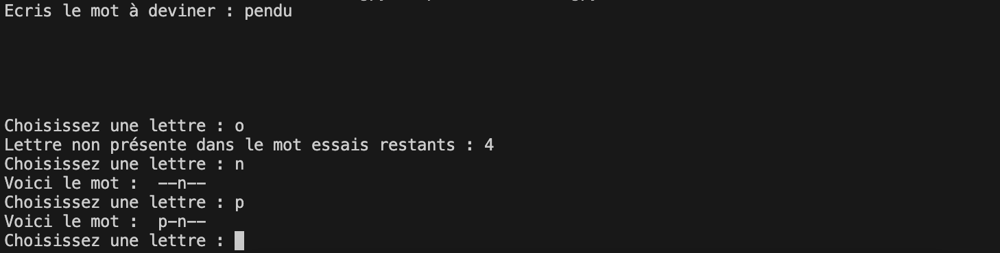
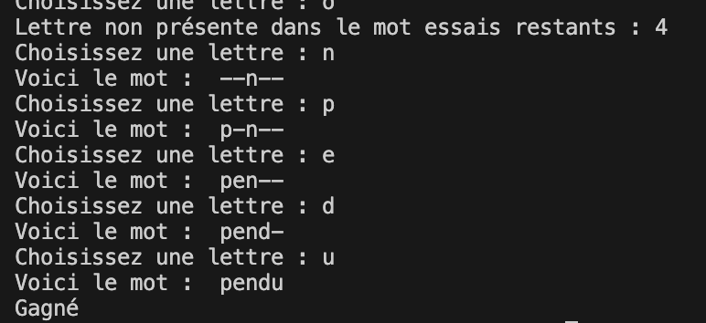

# Projet Pendu :

Le but du projet est de reproduire le pendu pour 2 joueurs. Les deux joueurs jouent sur le même ordinateur, le premier trouve le mot à faire deviner et le second doit retrouver le mot.

Voici un affichage **possible** pour le jeu :





Il s'agit d'une version basique du projet, il est possible (fortement conseillé) de rajouter d'autres fonctionnalités comme :

- Nom des joueurs
- Système de point / manche
- Affichage adapté pour caché le mot de départ

Voici les noms de fonction créées pour ce projet :

```python
def jeu( ):
	"""	Fonction principale du code, permettant de faire fonctionner le jeu """

def init_mot(mot) :
  """ Fonction permettant de créer le mot avec les tirets
  param mot : (str) mot à faire deviner
  exemple : init_mot('tortue') => '------'
  """

def ajoute_lettre( mot_joueur1, mot_joueur2, lettre) :
  """ Fonction ajoutant à mot_joueur2 la lettre si elle est présente dans mot_joueur1
  exemple : ajoute_lettre( 'tortue','t--t--','r') => 't-rt--'
  """
```

Evidemment, il ne faut pas faire exactement les mêmes fonctions, si il y a besoin de faire quelques fonctions de plus il faut les écrire.

## Partie programme :

Le programme est à rendre, avec les jeux de test (Juste besoin d'appuyer sur F5 pour jouer). Des commentaires, ainsi que la documentation des fonctions sont demandés.

## Partie écrite à rendre :

Avec le programme, une partie écrire est à rendre, il s'agit d'un carnet de bord contenant les étapes réalisées chaque séance. De plus, une explication sur la répartition choisie pour le travail est demandée.

S'il y a des fonctionnalités en plus, des lignes de code qui demandent une explication il est possible (recommandé) de l'écrire.

## Partie orale :

Il est possible qu'un passage à l'oral soit fait. Si tel est le cas, le besoin ou non de faire un diaporama sera exprimé.